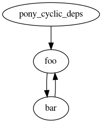

# circular dependencies in pony packages


This project contains 3 pony packages:

 - pony_cyclic_deps
 - foo
 - bar

Their dependency graph is as follows:




## Compiling with ponyc

```
make compile-with-ponyc
```

### Result
Ponyc produces a running executable. 

### Expected (postulated?) result:

I feel this should either error out or otherwise emit a warning that a
circular dependecy has been detected, and where.


## Compiling with stable

```
make compile-with-stable
```

### Result

On my machine (`Linux 4.19.16_3 #1 SMP PREEMPT x86_64 GNU/Linux1),
 this causes runaway growth of the memory used by the `stable` process.
 
### Expected result

I'd expect that the tooling would have detected a circular dependency
either errored out with an informative message, or otherwise produced
a warning (as above).


